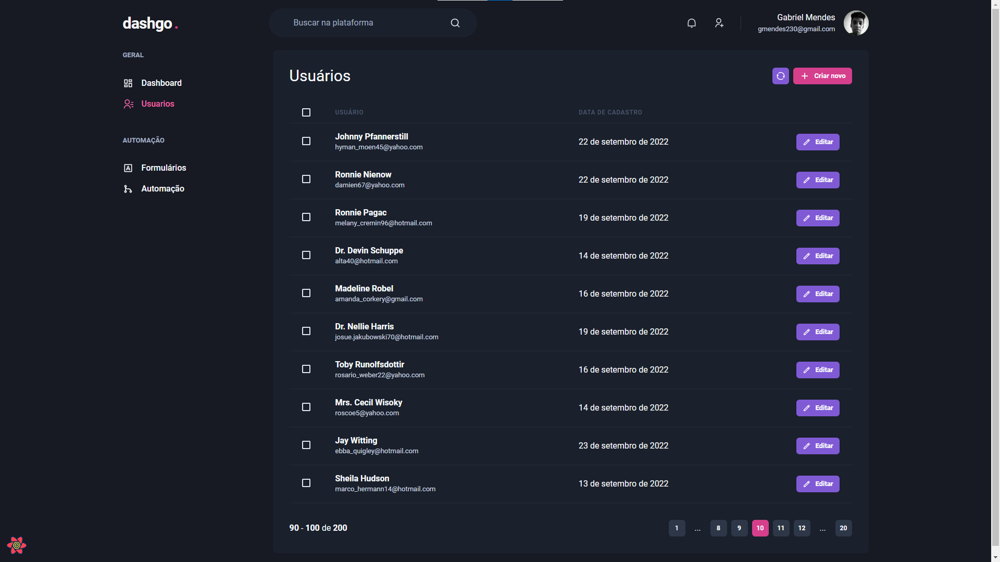

<h1 align='center' style='font-weight: bold;color:white;letter-spacing:-0.025rem;background:#171923;padding: 1.5rem 0'>
  dashgo<span style='margin-left: 0.25rem;color:#d53f8c'>.</span>
</h1>

This project was made to practice some concepts, like Design System, form validation, SWR caching, API mock, Authentication and SSR/SSG.

## 🛠️ Tecnologies

- [Next JS](https://nextjs.org/)
- [TypeScript](https://www.typescriptlang.org/)
- [Chakra UI](https://chakra-ui.com/)
- [React Icons](https://react-icons.github.io/react-icons/)
- [React Query](https://chakra-ui.com/)
- [Mirage JS](https://miragejs.com/)
- [Axios](https://axios-http.com/ptbr/docs/intro)

## 🔖 Result



## 🚀 Getting Started

First, run the development server:

```bash
npm run dev
# or
yarn dev
```

Open [http://localhost:3000](http://localhost:3000) with your browser to see the result.
